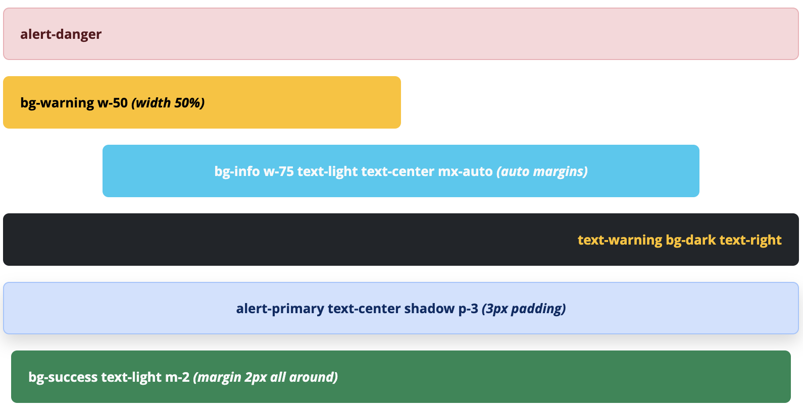
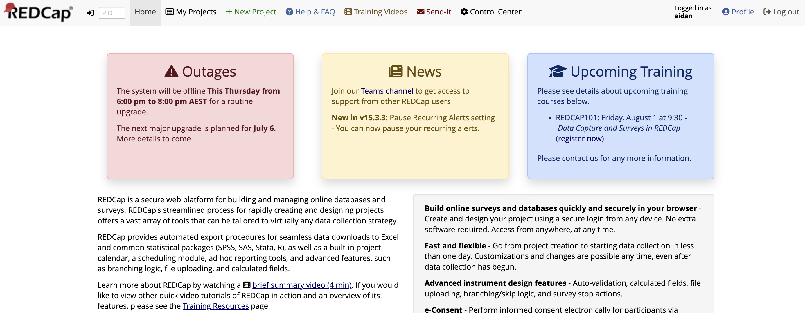

# REDCap Announcements

Allows REDCap administrators to configure announcements within categories, that will display to users in specified contexts (e.g., system pages, project pages, or on the REDCap login page).

Announcements can be timed to display between specific dates and times, and fallback text for each category can be specified if no current announcements exist in the category.

Use cases include:
- Upcoming training courses (with each course announcement being expired at the end of the course)
- Upcoming planned outages (expired at the end of the outage)
- Opportunities and job postings
- Grant opportunities
- News and updates

## Installation

This module can be installed from the REDCap Repo, or from GitHub.

To enable announcements to appear in a project context, the module must be enabled on all projects.

## Configuration

### The Announcements Project

The module fetches announcement details from records in a designated REDCap project (specified in the module configuration). This project should be built from the Project XML file supplied in this repository ([here](assets/Announcements_project_template.xml)). The project's data dictionary contains two instruments - "Categories" and "Announcements" - and two arms - "Categories" and "Announcements", so the single project can manage both announcements and the categories they fall within.

### Categories

For each category of announcement you want to configure (Training opportunities, Planned outages, etc.), create a record in the "Categories" arm, and configure the category for the following information:

| Field | Type | Description |
| --- | --- | --- |
| Category | Text | **(Not displayed in announcements)** A label for the category, to be used in the Announcement form as a Dynamic SQL dropdown, as a custom record label, and also to dynamically set CSS class names to support arbitrary styling. |
| Active | Yes/No | Used to disable all announcements in this category. |
| Scope | Checkbox | Scope where the announcements in this category are to be displayed. Choices include:<br><ol><li>System Pages</li><li>Project Pages</li><li>Login page (for unauthenticated users)</li></ol> |
| Order | Integer | A lower number indicates a higher display priority. If two categories have the same order, they are secondarily sorted by Record ID. |
| Title | Text | Title text for the category. |
| Font Awesome Icon | Text | Optional Font Awesome icon class name (e.g., `fas fa-info-circle`, `far fa-bell`), which is displayed next to the title. |
| Header | Text | Optional text displayed above the list of announcements within this category. |
| Footer | Text | Optional text displayed below the list of announcements within this category. |
| Fallback | Text | Message displayed if there are no active announcements in this category. If left blank and there are no current announcements, the whole category is not shown. |
| Custom CSS Classes | Text | Space-separated CSS class names (e.g., Bootstrap utilities like `w-50 mx-auto bg-warning text-danger p-3`). Applied to the main div of this category block. See Styling section below. |

### Announcements

After creating categories, individual announcements can be created within those categories. For each announcement, configure the following information:

| Field | Type | Description |
| --- | --- | --- |
| Label | Text | **(Not displayed in announcements)** Used as a custom record label for ease of finding the right announcement from the record status dashboard to edit it. |
| Category | Dropdown | **(Dynamic SQL)** The record from the Categories arm, i.e., the category, to which this announcement relates. |
| Active | Yes/No | Used to disable this announcement. |
| Order | Integer | A lower number indicates a higher display priority. If two announcements have the same order, they are secondarily sorted by Record ID. |
| Show From | Datetime | Announcement appears on or after this date/time. Leave blank to show immediately (if active). |
| Show Until | Datetime | Announcement disappears after this date/time. Leave blank to show indefinitely (if active). |
| Announcement Content | Text | The main content of the announcement. **HTML is allowed.** Use the rich-text editor to format this content (bold, italics, lists, alignment, line breaks, links etc.). |

## Styling

This module presents a number of ways to style alerts and their contents.

1. Announcement content may be styled using the Rich Text Editor.
2. Categories may be styled by the addition of CSS classes in the `Custom CSS Classes` field. This method is recommended for the most simple styling for entire categories together (such as `alert-danger` for a red alert block for outage notifications).
3. Categories and the outermost div may be styled by the addition of classes as configured in the module's system configuration. This is most useful for ensuring style consistency across all categories with classes such as `m-3` for margin, `p-3` for padding, `shadow`, `text-center`, etc., or styling the parent div itself.
4. Custom CSS can be injected using the module's system configuration, targeting the outermost div, the category divs (either all of them of each specifically), or even individual elements in the categories.

### Bootstrap classes 

As REDCap supports Bootstrap, administrators may utilise any of the classes supported by Bootstrap to style announcements in order to style the category div's colour, position, margin, padding, shadow, text alignment, etc.

The full documentation for Bootstrap can be found [here](https://getbootstrap.com/docs/5.0).

Examples:



**Note:** Due to the nature of CSS classes and the inheritance of style information from parents (cascading) being overridden by rules that have a higher precedence, some style rules added by classes may be overridden by REDCap's built-in styles. For example, setting the `text-center` class on a category will fore the title to be center-aligned, but the contents of any announcements in that category, unless they have explicit style information added, will likely be left-aligned due to the default style in the application.

As such, for best results you should ensure that both classes *and* explicit styles are employed.

### Dynamic IDs and Classes

This module creates whole new HTML divs: a div for the entire block of announcements, as well as a div per category. Each of these is assigned IDs and classes based on the category. These IDs and classes can then be used for targeting when inserting custom CSS in the module's system configuration. The schema is as follows (assumes the presence of two categories labelled `outages` and `training` for illustration purposes):

```html
<div id="rcannounce-wrapper" class="{wrapper_custom_classes}">
    <div id="rc-announce-cat-outages" class="rcannounce-category rcannounce-cat-outages alert {category_custom_classes} {custom_classes}">
        <h4 class="alert-title rcannounce-title">{title}</h4>
        <p class="rcannounce-hdr">{header}</p>
        <p class="rcannounce-desc">{desc}</p>
        <p class="rcannounce-footer">{footer}</p>
    </div>
    <div id="rc-announce-cat-training" class="rcannounce-category rcannounce-cat-training alert {category_custom_classes} {custom_classes}">
        <h4 class="alert-title rcannounce-title">{title}</h4>
        <p class="rcannounce-hdr">{header}</p>
        <p class="rcannounce-desc">{desc}</p>
        <p class="rcannounce-footer">{footer}</p>
    </div>
</div>
```

**Note:** `{wrapper_custom_classes}` and `{category_custom_classes}` pertain to the module system configuration options, while other variables pertain to the values of the project variables.

This allows for injection of CSS in the module configuration, for example to display categories in a flex container. The following CSS produces a multi-column layout as shown in the screenshot below.

```css
#rcannounce-wrapper {
    display: flex;
    flex-wrap: wrap;
    gap: 1rem; 
}
#rcannounce-wrapper .rcannounce-category {
    flex: 1 1 300px;
    box-sizing: border-box;
}
```



## Todo

- Add support for projects to display their own internal announcements to their users

## AI Involvement Declaration

The core concept, primary features, and overall direction of this REDCap Announcements module were substantively ideated and developed by Aidan Wilson. Throughout the development process, Google's Gemini large language model (2.5 Pro) provided valuable assistance, contributing to areas such as code suggestions, troubleshooting specific issues, generating examples, and offering guidance on implementation strategies and best practices relevant to the REDCap External Module framework.
