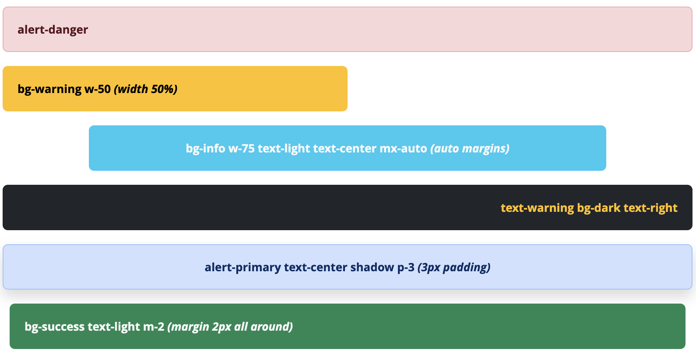
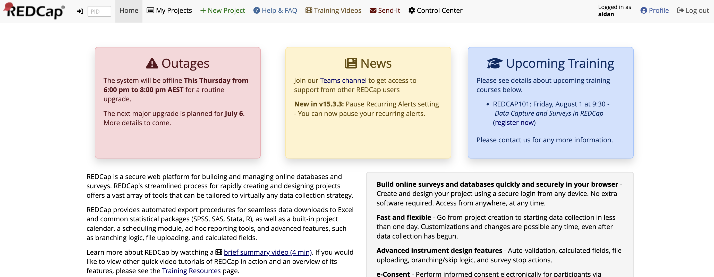

# REDCap Announcements

Allows REDCap administrators to configure announcements within categories, that will display to users in specified contexts (e.g., system pages, project pages, or on the REDCap login page).

Announcements can be timed to display between specific dates and times, and fallback text for each category can be specified if no current announcements exist in the category.

Use cases include:
- Upcoming training courses (with each course announcement being expired at the end of the course)
- Upcoming planned outages (expired at the end of the outage)
- Opportunities and job postings
- Grant opportunities
- News and updates

## Installation

This module can be installed from the REDCap Repo, or from GitHub.

**Important:** To enable announcements to appear in a project context (where 'Project' is checked for 'Scope'), the module must be enabled on all projects in the system-wide configuration. It should also be hidden from regular users' view by checking the _Hide this module from non-admins in the list of enabled modules on each project_ option.

## Configuration

A link to the Announcements project XML file and instructions for its implementation can be found on the Control Center External Module page [_Announcements Setup_](?prefix=announcements&page=setup).

### The Announcements Project

The module fetches announcement and category details from records in a designated REDCap project (specified in the module configuration). This project should be built from the Project XML file linked to from the setup page. The project's data dictionary contains two instruments - "Categories" and "Announcements" - and two arms - "Categories" and "Announcements", so the single project can manage both announcements and the categories they fall within.

**Important:** The Announcements project must be built correctly, and in particular, the Dynamic SQL fields that are used to populate the drop-down lists of categories and query filters, must be configured by an administrator, since they cannot be automatically populated from the data dictionary.

### Categories

For each category of announcement you want to configure (Training opportunities, Planned outages, etc.), create a record in the "Categories" arm, and configure the category for the following information:

| Field | Type | Description |
| --- | --- | --- |
| Category | Text | **(Not displayed in announcements)** A label for the category, to be used in the Announcement form as a Dynamic SQL dropdown, as a custom record label, and also to dynamically set CSS class names to support arbitrary styling. |
| Active | Yes/No | Used to disable all announcements in this category. |
| Scope | Checkbox | Scope where the announcements in this category are to be displayed. Choices include:<br><ol><li>System Pages</li><li>Project Pages</li><li>Login page (for unauthenticated users)</li></ol> |
| Order | Integer | A lower number indicates a higher display priority. If two categories have the same order, they are secondarily sorted by Record ID. |
| Title | Text | Title text for the category. |
| Font Awesome Icon | Text | Optional Font Awesome icon class name (e.g., `fas fa-info-circle`, `far fa-bell`), which is displayed next to the title. |
| Header | Text | Optional text displayed above the list of announcements within this category. |
| Footer | Text | Optional text displayed below the list of announcements within this category. |
| Fallback | Text | Message displayed if there are no active announcements in this category. If left blank and there are no current announcements, the whole category is not shown. |
| Custom CSS Classes | Text | Space-separated CSS class names (e.g., Bootstrap utilities like `w-50 mx-auto bg-warning text-danger p-3`). Applied to the main div of this category block. See Styling section below. |

### Announcements

After creating categories, individual announcements can be created within those categories. For each announcement, configure the following information:

| Field | Type | Description |
| --- | --- | --- |
| Category | Dropdown | **(Dynamic SQL)** The record from the Categories arm, i.e., the category, to which this announcement relates. |
| Label | Text | **(Not displayed in announcements)** Used as a custom record label for ease of finding the right announcement from the record status dashboard to edit it. |
| Active | Yes/No | Used to disable this announcement. |
| Order | Integer | A lower number indicates a higher display priority. If two announcements have the same order, they are secondarily sorted by Record ID. |
| Project ID list | Text | A comma-separated list of project IDs or ranges, such as `102, 105, 110-115`, such that if the announcement is to be displayed in a Project context, it will only display if the project ID is in this list. |
| Query Filter | Dropdown | **(Dynamic SQL)** Select from a list of administrator defined project queries, such that if the announcement is to be displayed in a Project context, it will only display if the project ID is found in the selected query. |
| Show From | Datetime | Announcement appears on or after this date/time. Leave blank to show immediately (if active). |
| Show Until | Datetime | Announcement disappears after this date/time. Leave blank to show indefinitely (if active). |
| Announcement Content | Text | The main content of the announcement. **HTML is allowed.** Use the rich-text editor to format this content (bold, italics, lists, alignment, line breaks, links etc.). |

## Scope

Categories of announcements may be configured to be displayed in specific contexts, called Scope. The available scopes are as follows:

| Scope | Description |
| --- | --- |
| System | The My Projects page and the New Project page. |
| Project | The project home page and the project setup page, these being the two pages that a user is most likely to navigate to regardless of the status of their project. **Requires the module to be enabled on all projects.** |
| Login | The REDCap login page, where announcements are displayed to unauthenticated users. |

Administrators may choose which categories of announcements are relevant to which scopes by checking the appropriate checkbox option for that category in their Announcements project. For example, training opportunities might be relevant for System and Login pages, but would clutter the Project pages too much, whereas outage notifications are probably relevant in all scopes. An announcement about how to get access to REDCap is only relevant for the Login scope (however this is more easily done using the Login text in Control Center).

## Project Filters

Announcements that are in categories that have project scope may be filtered as to which projects they appear on, either by specifying a comma-separated list of project IDs, or by selecting a pre-defined project query filter.

If both a Project ID list and a query filter are specified, then both must match for the announcement to be displayed.

### Project ID list

The Project ID List `[pid_list]` variable in the announcements project can be used to specify a list of project IDs or ranges, such as `102, 105, 110-115`, such that if the announcement is to be displayed in a Project context, it will only display if the project ID is in this list and the category has project scope.

### Query Filters (advanced)

For most robust dynamic filtering, an administrator may define custom project queries (called filters), by preparing a SQL statement that returns (at minimum) a column of project ID values. The announcement will only be displayed if the project ID is returned by the selected query.

The Announcements module will, in a project context, determine if a filter query has been specified for an announcement. If a query has been specified, the pre-defined query is executed as a sub-query, and its project_id column is returned, and the current project's project_id is compared using the Framework's parameterised `query()` method. This maximises safety and protects against possible SQL injection, or accidental execution of a query that could cause deletion or modification of data.

Filter are labelled with a name that is then selected from a dropdown list. The name may be any string, with or without spaces. If two queries have the same name, only the first will be evaluated.

Examples of filter queries include:

All projects with Research purposes and Development status:
```SQL
SELECT project_id
FROM   redcap_projects
WHERE  status = 0
AND    purpose = 2
```

All projects that have a specific module (`my_module`, for illustrative purposes) enabled (note that the `key` field must be escaped by backticks as it is a reserved word in MySQL):
```SQL
SELECT project_id
FROM   redcap_external_module_settings
WHERE  `key` = 'enabled'
AND    value = 'true'
AND    external_module_id = (
    SELECT external_module_id
    FROM   redcap_external_modules
    WHERE  directory_prefix = 'my_module'
)
```

All projects with a user whose primary email address is not within the domain 'myinstitute.org' and who has either `design`, `data_access_groups` or `user_rights` - the 'highest-level' - privileges:
```SQL
SELECT rur.project_id
FROM   redcap_user_rights rur
JOIN   redcap_user_information rui
ON     rur.username = rui.username
WHERE  1 IN (rur.design, rur.data_access_groups, rur.user_rights)
AND    rui.user_email NOT LIKE '%myinstitute.org'
```

It is crucial that you use the Database Query Tool to test that your queries return the correct results, before using the for announcements. If a query fails to execute or does not return a project_id column, a message will be logged to the Announcement project's External Modules log.

## Styling

This module presents a number of ways to style alerts and their contents.

1. Announcement content may be styled using the Rich Text Editor.
2. Categories may be styled by the addition of CSS classes in the `Custom CSS Classes` field. This method is recommended for the most simple styling for entire categories together (such as `alert-danger` for a red alert block for outage notifications).
3. Categories and the outermost div may be styled by the addition of classes as configured in the module's system configuration. This is most useful for ensuring style consistency across all categories with classes such as `m-3` for margin, `p-3` for padding, `shadow`, `text-center`, etc., or styling the parent div itself.
4. Custom CSS can be injected using the module's system configuration, targeting the outermost div, the category divs (either all of them of each specifically), or even individual elements in the categories.

### Bootstrap classes 

As REDCap supports Bootstrap, administrators may utilise any of the classes supported by Bootstrap to style announcements in order to style the category div's colour, position, margin, padding, shadow, text alignment, etc.

The full documentation for Bootstrap can be found [here](https://getbootstrap.com/docs/5.0).

Examples:



**Note:** Due to the nature of CSS classes and the inheritance of style information from parents (cascading) being overridden by rules that have a higher precedence, some style rules added by classes may be overridden by REDCap's built-in styles. For example, setting the `text-center` class on a category will fore the title to be center-aligned, but the contents of any announcements in that category, unless they have explicit style information added, will likely be left-aligned due to the default style in the application.

As such, for best results you should ensure that both classes *and* explicit styles are employed.

### Dynamic IDs and Classes

This module creates whole new HTML divs: a div for the entire block of announcements, as well as a div per category. Each of these is assigned IDs and classes based on the category. These IDs and classes can then be used for targeting when inserting custom CSS in the module's system configuration. The schema is as follows (assumes the presence of two categories labelled `outages` and `training` for illustration purposes):

```html
<div id="rcannounce-wrapper" class="rcannounce-context-{context} {wrapper_custom_classes}">
    <div id="rc-announce-cat-outages" class="rcannounce-category rcannounce-cat-outages alert {category_custom_classes} {custom_classes}">
        <h4 class="alert-title rcannounce-title">{title}</h4>
        <p class="rcannounce-hdr">{header}</p>
        <p class="rcannounce-desc">{desc}</p>
        <p class="rcannounce-footer">{footer}</p>
    </div>
    <div id="rc-announce-cat-training" class="rcannounce-category rcannounce-cat-training alert {category_custom_classes} {custom_classes}">
        <h4 class="alert-title rcannounce-title">{title}</h4>
        <p class="rcannounce-hdr">{header}</p>
        <p class="rcannounce-desc">{desc}</p>
        <p class="rcannounce-footer">{footer}</p>
    </div>
</div>
```

**Note:** `{wrapper_custom_classes}` and `{category_custom_classes}` pertain to the module system configuration options, while other variables pertain to the values of the project variables. 

This allows for injection of CSS in the module configuration, for example to display categories in a flex container. The following CSS produces a multi-column layout as shown in the screenshot below. To achieve this effect, copy the css below into the `Custom CSS` field in the module configuration:

```css
#rcannounce-wrapper {
    display: flex;
    flex-wrap: wrap;
    gap: 1rem; 
}
#rcannounce-wrapper .rcannounce-category {
    flex: 1 1 300px;
    box-sizing: border-box;
}
```



**Note:** `{context}` is either `system`, `project`, or `login`, depending on the context in which the announcements are displayed. The `rcannounce-context-{context}` class therefore allows the administrator to target the announcement wrapper div or any of its children in specific contexts.

This is particularly useful to adjust the width carefully to fit the page. The position in the page in which announcements are placed on Project pages by default means that announcements use the full width of the page, apart from the left sidebar. This can be corrected with the following rule:

```css
.rcannounce-context-project {
    max-width: 800px;
}
```

For ease, there is a configuration option to automatically add this styling to the parent div on project pages.

The announcements in the above screenshot also have custom classes on the wrapper (`m-3 p-3` for a basic margin and padding) and the category (`shadow text-center` to add a shadow and center-align the title text). Using `text-center` will center everything inside the category div, including the text of the announcement. Use the rich text editor when creating announcements if you need the body of the announcements to have left-aligned text.

## Debug logging

This module provides a debug log that can be enabled in the control center. When enabled, messages pertaining to the module's logic will be displayed in the JavaScript console. This can help diagnose unexpected behavior or issues with the module, such as the module not working in the correct contexts, or announcements displaying in the wrong contexts or projects, or not displaying in the correct contexts or projects.

The number of messages output to the JavaScript log can be high, depending on the number of categories, announcements, and named filters. As such the debug option should only be enabled for troubleshooting purposes but disabled at other times.

If a named query fails to execute, such as if it is a malformed query or does not return a project_id column, then an error message with the problematic query and details about the announcement and the project that attempted to display it will be output to the Announcement project's External Module log. This happens regardless of the Debug setting.

## Todo

- Add support for projects to display their own internal announcements to their users

## Changelog

| Version | Description |
| --- | --- |
| v1.0.0 | Initial Release |
| v1.1.0 | Adds a custom class to the `rcaccounce-wrapper` div to allow admins to target specific scopes for CSS injection.<br/>Improves instructions in the README and setup.php page. |
| v1.1.1 | Bugfix: In some cases when a user logs out of REDCap, announcements were incorrectly displayed to them as if they were logged in.<br/>Bugfix: Minor typo in announcement project template XML. |
| v1.1.2 | Adds a Debug mode, some minor enhancements. |
| v1.2.0 | Adds query filters and PID list support to control the projects that announcements with project-scope appear on. |

## AI Involvement Declaration

The core concept, primary features, and overall direction of this REDCap Announcements module were substantively ideated and developed by Aidan Wilson. Throughout the development process, Google's Gemini large language model (2.5 Pro) provided valuable assistance, contributing to areas such as code suggestions, troubleshooting specific issues, generating examples, and offering guidance on implementation strategies and best practices relevant to the REDCap External Module framework.
